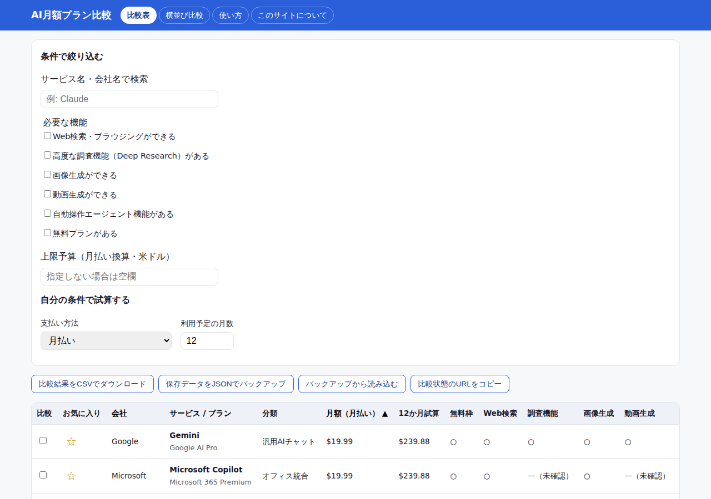
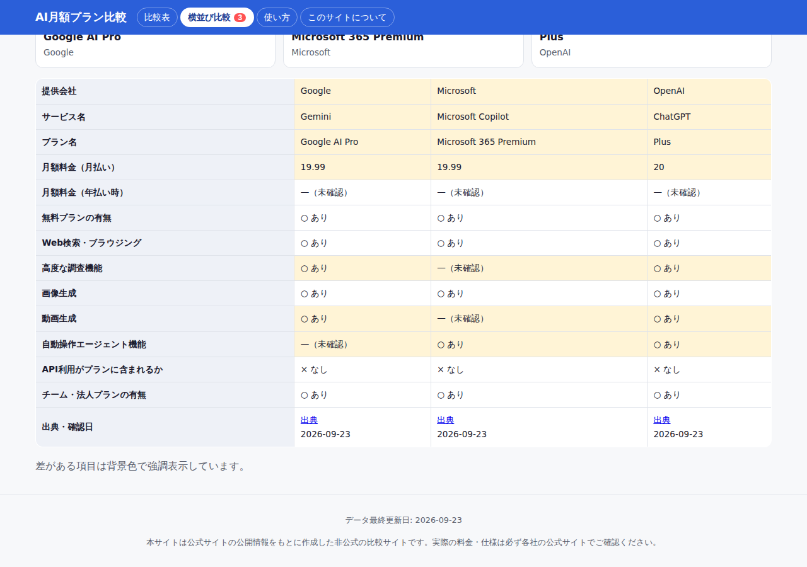
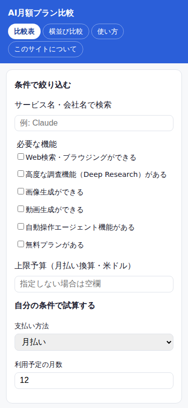

# AI月額プラン比較サイト 使い方説明書

この説明書は、パソコンやプログラミングに詳しくない方でも読めるように書いています。

## 1. このサイトでできること

ChatGPT・Claude・Gemini・Perplexity・Grok・Microsoft Copilotなど、代表的なAIアシスタントの月額プランを、料金や機能で比べられます。「結局どれに課金すればいいの?」と迷っている方に向いています。

## 2. はじめに知っておいてほしいこと

- 掲載しているデータは、**2026年9月23日**時点で確認した公式サイトの情報をもとにしています。
- AIサービスの料金・機能は変わることがあります。契約前には必ず公式サイトの最新情報をご確認ください。
- 入力した内容（絞り込み条件・お気に入り）は、あなたが使っているブラウザの中だけに保存されます。他の人やサイト運営者に送られることはありません。

## 3. サイトの開き方

- 公開済みの場合は、案内されたURLをブラウザ（Chrome、Safari、Edgeなど）で開いてください。
- ZIPファイルで受け取った場合は、ZIPを展開（解凍）したフォルダの中の `dist` フォルダにある `index.html` を、ブラウザにドラッグ＆ドロップして開いてください。ファイルをダブルクリックしただけでは、一部の機能（比較状態の保存など）が正しく動かない場合があります。その場合は、フォルダごとブラウザの拡張機能や簡易サーバーで開くか、サイト運営者にご確認ください。

## 4. 使い方（ステップごと）

### 手順1: 一覧を見る

画面上部の『比較表』タブが最初に開きます。ここに、すべてのプランが表になって並んでいます。

*画面上部の「条件で絞り込む」欄と、下に続く比較表が表示されます。*

### 手順2: 条件で絞り込む・並べ替える

「条件で絞り込む」の中にある『必要な機能』のチェックボックスにチェックを入れると、その機能を持つプランだけが表示されます。『上限予算（月払い換算・米ドル）』に数字を入れると、その金額以下のプランだけに絞り込まれます。

比較表の見出し（「会社」「サービス / プラン」「月額（月払い）」）を押すと、その項目で並べ替えられます。

### 手順3: 気になる候補を選んで横に並べて比べる

比較表の左端『比較』列のチェックボックスにチェックを入れると（最大4件まで）、画面上部の『横並び比較』タブでまとめて見比べられます。

*選んだプランがカードで並び、下の表で違いのある項目には色がついて分かりやすくなっています。*

### 手順4: 自分の条件を入れて金額などを試算する

「条件で絞り込む」の中の『自分の条件で試算する』で、『支払い方法』（月払い／年払い）と『利用予定の月数』を選ぶと、比較表の右側「〇か月試算」の欄に、概算の合計金額が表示されます。

### 手順5: 結果を保存する

- 『比較結果をCSVでダウンロード』ボタンを押すと、今表示されている一覧をファイルとして保存できます。Excelなどで開けます。
- 『保存データをJSONでバックアップ』ボタンを押すと、お気に入りや絞り込み条件をファイルとして保存できます。パソコンを買い替えたときなどに使ってください。
- 保存したファイルを読み込むには『バックアップから読み込む』ボタンを押し、保存しておいたファイルを選んでください。

### 手順6: 比較結果を人に共有する

『比較状態のURLをコピー』ボタンを押すと、今選んでいる比較対象がわかるURLがコピーされます。メールやチャットに貼り付けて、人と共有できます。

## 5. 画面の見方

- 表の各列は、会社名・サービス名・プラン名・月額料金・無料プランの有無・主な機能などを表しています。
- 「—（未確認）」と表示されている項目は、公式サイトの情報だけでは確認できなかった項目です。分からないことを推測で埋めていないという意味です。
- 各行の『出典』リンクを押すと、そのデータの元になった公式サイトのページが開きます。その下に「確認日」も表示されています。
- 将来、広告やアフィリエイトリンクを含む場合は、リンクの近くに「PR」または「広告」の表記が必ず表示されます（2026年9月時点では未導入です）。

## 6. スマホで使うとき

*スマホでは画面の幅に合わせてボタンや入力欄が縦に並びます。*

スマホでは比較表が横に長くなるため、指で横にスクロールして残りの列を確認してください。

ホーム画面に追加すると、アプリのように開けて、電波が悪い場所でも一度見た比較表を確認できるようになります（追加方法はブラウザにより異なります。Safariの場合は共有ボタンから「ホーム画面に追加」を選んでください）。

## 7. よくある質問（Q&A）

**Q. データはいつ更新されますか？**
A. 各プランの「確認日」を表の右端に表示しています。定期的に公式サイトと照合して更新する予定です。90日以上経つと古くなっている可能性があります。

**Q. 入力した内容はどこかに送られますか？**
A. 送られません。絞り込み条件やお気に入りは、あなたのブラウザの中だけに保存されます。

**Q. CSVをExcelで開くと文字化けします**
A. 本サイトのCSVはUTF-8(BOM付き)という文字コードで出力しており、最近のExcelでは文字化けしないはずです。文字化けする場合は、Excelの「データ」タブから「テキストファイルから」インポートし、文字コードに「UTF-8」を指定して開いてください。

**Q. 前に保存した比較リストが消えました**
A. ブラウザの「閲覧履歴の消去」等でサイトデータを削除すると、保存内容も消えます。定期的に『保存データをJSONでバックアップ』でファイルに保存しておくことをおすすめします。

**Q. 表示されている料金と公式サイトの料金が違います**
A. 料金は変更されることがあります。「出典」リンクから必ず公式サイトの最新情報をご確認ください。

**Q. 「PR」「広告」の表記が無いのはなぜですか？**
A. 本サイトは2026年9月時点でアフィリエイト・広告を導入していないためです。導入した場合は必ず表記します。

## 8. 困ったときは

- 表示がおかしいときは、ブラウザの再読み込み（更新）ボタンを押してください。
- お気に入りや条件をリセットしてやり直したいときは、ブラウザの設定からこのサイトの「サイトデータ」を削除してください（ブラウザにより手順が異なります）。
- バックアップからの復元は、手順5の『バックアップから読み込む』ボタンから、保存しておいたJSONファイルを選んでください。

## 9. 用語集

- **CSV**: 表形式のデータを保存するファイル形式。Excelなどで開けます。
- **ブラウザ**: Webサイトを見るためのアプリ（Chrome、Safari、Edgeなど）。
- **キャッシュ**: 一度読み込んだデータをブラウザの中に一時的に保存しておく仕組み。オフラインでも表示できるようにするために使われます。
- **オフライン**: インターネットに接続していない状態。
- **PWA**: Webサイトをアプリのように使えるようにする仕組み。ホーム画面に追加できます。
- **税込/税抜**: 「税込」は消費税を含んだ金額、「税抜」は消費税を含まない金額。本サイトの料金は米ドル表記の公式価格をそのまま掲載しており、日本の消費税は考慮していません。

## 10. サイト運営者（オーナー）向け: データの更新方法

データの更新は `src/data/plans.json` というファイルを編集して行います。詳しい手順は `docs/DATA_UPDATE.md` にまとめています。一例として、ChatGPT Plusの月額料金を書き換える手順を掲載しているので、参考にしてください。

## 11. サイト運営者（オーナー）向け: 公開するまでにやること

詳細は `docs/REPORT.md`（日次レポート）の「公開に向けて人間がすべきこと」、および `docs/RELEASE.md` にまとめています。主なものは次のとおりです。

| やること | なぜ必要か | 目安 |
|---|---|---|
| 比較データの最終目視確認 | 一部のデータは公式サイトへ直接アクセスできず、検索エンジン経由で確認したため | 30分〜1時間・無料 |
| リポジトリを公開するかどうかの判断 | 現在は非公開（private）のため | 数分・無料 |
| 静的ホスティングの有効化 | サイトを実際にインターネットに公開するため | 30分程度・多くは無料 |
| アフィリエイト提携の申請（収益化する場合） | 各社ASPとの契約が必要なため | 要確認（サービスによる） |
| プライバシーポリシー等の最終確認 | 法的な文言のため、専門家の確認が望ましい | 要確認 |
